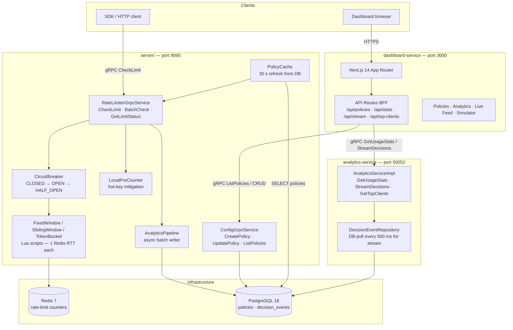

# RateForge — Architecture

## System Diagram

## Services

| Service | Port | Responsibility |
|---------|------|----------------|
| `server/` | 9090 | gRPC rate-limit decisions + policy CRUD + analytics write |
| `analytics-service/` | 50052 | gRPC analytics read API (stats, stream, top-clients) |
| `dashboard-service/` | 3000 | Next.js BFF + admin UI |
| Redis | 6379 | Rate-limit state (atomic Lua counters) |
| PostgreSQL | 5432 | Policies + decision event log |

## Request flow — CheckLimit

1. Client calls `CheckLimit(clientId, endpoint, method, cost)`
2. `PolicyMatcher` finds highest-priority matching policy from `PolicyCache`
3. `LocalPreCounter` checks if request is a hot key → pre-allocate Redis budget
4. `CircuitBreaker` wraps Redis call — fail-open if Redis is down
5. Algorithm executes Lua script (1 Redis RTT):
   - **Fixed Window**: `INCR key; EXPIRE if new`
   - **Sliding Window**: `ZREMRANGEBYSCORE; ZCARD; ZADD`
   - **Token Bucket**: `HGET tokens,last_refill; compute refill; HSET`
6. Decision (allow/deny) returned to client
7. `AnalyticsPipeline.publish()` enqueues event async (non-blocking)
8. `BatchProcessor` flushes to PostgreSQL every 500 ms or 1 000 events

## Key design decisions

- **Lua scripts for atomicity** — all counter mutations are single-script, no WATCH/MULTI/EXEC needed
- **Fail-open circuit breaker** — Redis outage degrades gracefully (allows traffic)
- **DB-poll streaming** — `StreamDecisions` tails PostgreSQL every 500 ms, avoiding cross-process SharedFlow coupling
- **Policy cache** — 30-second in-memory cache prevents DB round-trip on every request; cache refreshes automatically
- **Hot-key mitigation** — Caffeine-backed pre-counter batches Redis round-trips for keys > 100 req/s
