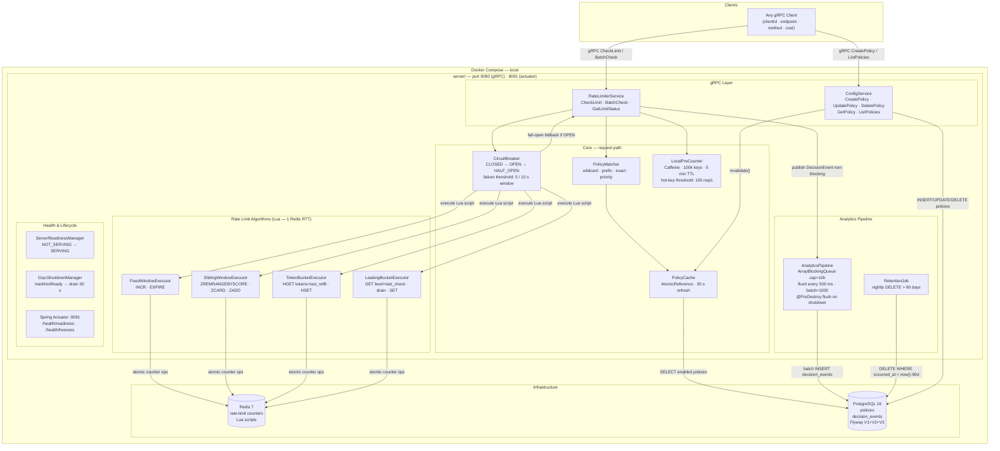

# RateForge

A distributed rate limiter built with Kotlin, Spring Boot, gRPC, Redis, and PostgreSQL.
Enforces per-client, per-endpoint rate limits using configurable policies and multiple algorithms.
Built as a portfolio project.

> For deep technical details see [ARCHITECTURE.md](ARCHITECTURE.md) and [SYSTEM_DESIGN.md](SYSTEM_DESIGN.md).

---

## What it does

- **Rate limit decisions** over gRPC — single check, batch check, or quota status query
- **Four algorithms** — Fixed Window, Sliding Window, Token Bucket, Leaking Bucket (all implemented as atomic Lua scripts, 1 Redis RTT each)
- **Soft rate limiting** — configurable grace budget that allows a percentage of requests beyond the hard limit before denying
- **Policy management** — CRUD over gRPC; policies stored in PostgreSQL and cached in-process with a 30 s refresh
- **Circuit breaker** — wraps every Redis call; degrades to fail-open or fail-closed if Redis is unavailable
- **Hot-key mitigation** — Caffeine-backed pre-counter batches Redis round-trips for keys exceeding 100 req/s
- **Analytics pipeline** — decision events written asynchronously to PostgreSQL (non-blocking queue, batch flush every 500 ms)
- **Graceful shutdown** — drains in-flight gRPC calls for up to 30 s before the process exits

---

## Architecture



---

## Request flow — CheckLimit

1. Client calls `CheckLimit(clientId, endpoint, method, cost)`
2. If circuit breaker is **OPEN** → return fallback immediately (no Redis call)
3. `PolicyMatcher` finds the highest-priority matching policy from `PolicyCache`
4. If no policy matches → return `FAIL_OPEN` (allow) or `FAIL_CLOSED` (deny) per server default
5. `LocalPreCounter` checks if this is a hot key → serve from local budget if available (no Redis RTT)
6. Circuit breaker executes the algorithm's Lua script:
   - **Fixed Window**: `INCR key; EXPIRE if new`
   - **Sliding Window**: `ZREMRANGEBYSCORE; ZCARD; ZADD`
   - **Token Bucket**: `HGET tokens+last_refill; compute refill; HSET`
   - **Leaking Bucket**: `GET level+last_check; drain elapsed; SET new level`
7. Response returned to client (`allowed`, `remaining`, `resetAtMs`, `policyId`, `reason`)
8. `AnalyticsPipeline.offer()` enqueues the decision event non-blocking; flushed to PostgreSQL every 500 ms

---

## Stack

| Layer | Technology |
|-------|-----------|
| Language | Kotlin + Coroutines |
| Framework | Spring Boot 3.2 |
| API | gRPC (`grpc-spring-boot-starter` 3.1, `grpc-kotlin-stub` 1.4) |
| Cache | Redis 7 (Lua scripts via Lettuce) |
| Database | PostgreSQL 16 (JPA + Flyway) |
| Local setup | Docker Compose |

---

## Running locally

Requires Docker Desktop.

```bash
docker compose up --build
```

| Service | Address |
|---------|---------|
| gRPC server | `localhost:9090` |
| Spring Actuator | `localhost:9091` |
| PostgreSQL | `localhost:5432` |
| Redis | `localhost:6379` |

Health check:
```bash
curl http://localhost:9091/actuator/health/readiness
```

Run the included traffic test:
```bash
node test-traffic.mjs
```

---

## gRPC API

### RateLimiterService

| RPC | Description |
|-----|-------------|
| `CheckLimit` | Single rate limit decision |
| `BatchCheck` | Multiple checks in one call, processed in parallel |
| `GetLimitStatus` | Query remaining quota without consuming it |

```protobuf
message CheckLimitRequest {
  string client_id = 1;
  string endpoint  = 2;
  string method    = 3;
  int64  cost      = 4;   // defaults to 1
}

message CheckLimitResponse {
  bool          allowed       = 1;
  int64         remaining     = 2;
  int64         reset_at_ms   = 3;
  string        policy_id     = 4;
  DecisionReason reason       = 5;
  int64         policy_limit  = 6;
}
```

`DecisionReason` values: `ALLOWED`, `RATE_LIMITED`, `SOFT_LIMITED`, `NO_POLICY_FAIL_OPEN`, `NO_POLICY_FAIL_CLOSED`, `CIRCUIT_OPEN`, `VALIDATION_ERROR`

### ConfigService

| RPC | Description |
|-----|-------------|
| `CreatePolicy` | Create a new rate limit policy |
| `UpdatePolicy` | Update an existing policy |
| `DeletePolicy` | Delete a policy by ID |
| `GetPolicy` | Fetch a single policy |
| `ListPolicies` | Paginated list with optional enabled-only filter |

---

## Policies

| Field | Description |
|-------|-------------|
| `client_id` | Client identifier, or `*` to match all |
| `endpoint` | Exact path, prefix (`/api/*`), or `*` |
| `method` | HTTP method or `*` |
| `algorithm` | `FIXED_WINDOW`, `SLIDING_WINDOW`, `TOKEN_BUCKET`, `LEAKING_BUCKET` |
| `limit` | Max requests per window (hard limit) |
| `soft_limit` | Optional — requests above this but below `limit` get `SOFT_LIMITED` reason |
| `window_ms` | Window duration in milliseconds |
| `priority` | Lower number = matched first when multiple policies apply |
| `no_match_behavior` | `FAIL_OPEN` or `FAIL_CLOSED` when no policy matches |

Token Bucket additionally requires `bucket_size` and `refill_rate`.
Leaking Bucket additionally requires `bucket_size` and `drain_rate`.

---

## Database

Three Flyway migrations:

| Migration | Contents |
|-----------|----------|
| V1 | `policies` and `decision_events` tables |
| V2 | Composite indexes for analytics, FK constraint, `UNIQUE(client_id, endpoint, method)` |
| V3 | `soft_limit` column on `policies` |

**Key indexes on `decision_events`:**
- `(client_id, occurred_at DESC)` — top-clients query
- `(policy_id, occurred_at DESC)` — per-policy usage stats
- `(allowed, occurred_at DESC)` — deny-rate queries

---

## Configuration

Key properties in `application.yml`:

```yaml
rateforge:
  default-no-match-behavior: FAIL_OPEN
  policy-cache-refresh-interval-ms: 30000
  circuit-breaker:
    failure-threshold: 5
    window-ms: 10000
    probe-interval-ms: 30000
    success-threshold: 2
  analytics:
    queue-capacity: 10000
    flush-interval-ms: 500
    retention-days: 90
  timeouts:
    grpc-request-ms: 5000
  shutdown:
    drain-timeout-ms: 30000

management:
  server:
    port: 9091
  endpoint:
    health:
      group:
        readiness:
          include: redis,database,circuitBreakerHealth
```

Infrastructure hostnames: `DB_HOST`, `DB_PORT`, `REDIS_HOST`, `REDIS_PORT` (all overridable via env vars).

---

## Tests

```bash
./gradlew test
```

| Package | Coverage |
|---------|---------|
| `algorithm` | Fixed/Sliding/Token algorithm correctness, cost multiplier, window expiry, client isolation |
| `circuit` | CircuitBreaker state transitions, probe logic, fallback behavior |
| `hotkey` | LocalPreCounter hot-key detection, local budget lifecycle |
| `policy` | PolicyMatcher priority ordering, wildcard/prefix matching, case-insensitive methods |
| `logging` | CorrelationIdInterceptor header propagation, MDC lifecycle |
| `security` | AuthInterceptor API key validation, unauthenticated bypass for health/reflection |
