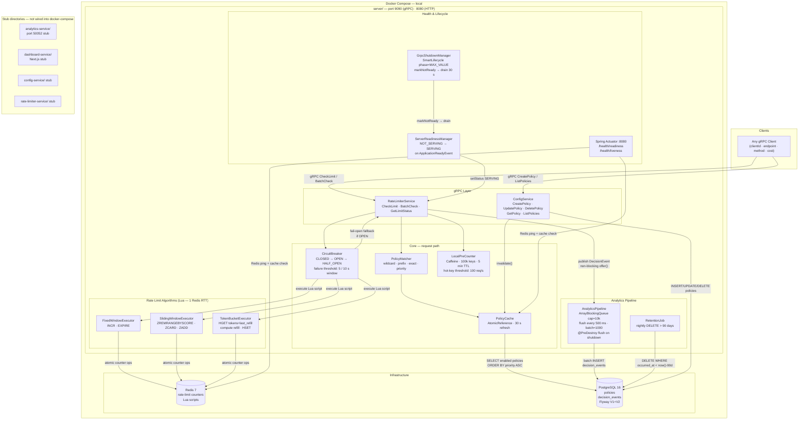
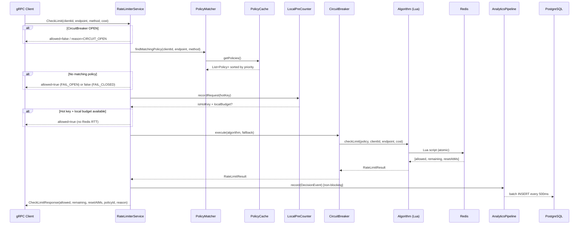
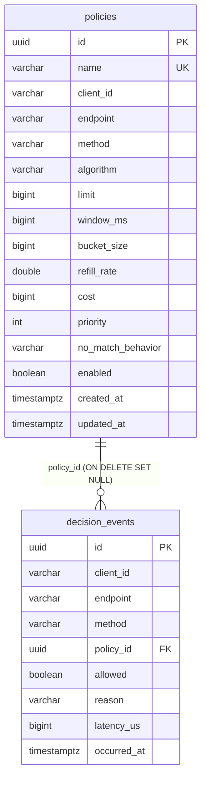
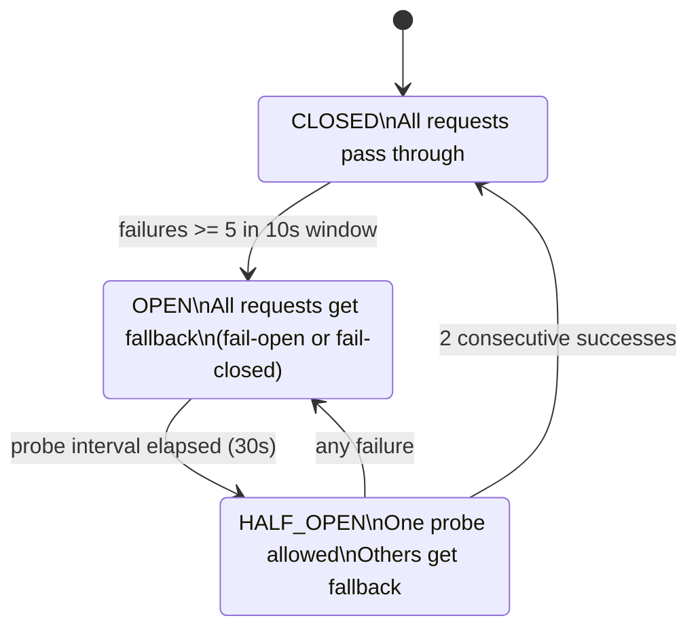

# RateForge — System Design

## Complete Architecture Diagram

---

## Request Flow — CheckLimit

---

## Data Model

**Indexes (V2 migration):**
- `idx_de_client_occurred` — `(client_id, occurred_at DESC)` — top-clients query
- `idx_de_policy_occurred` — `(policy_id, occurred_at DESC)` — per-policy usage stats
- `idx_de_allowed_occurred` — `(allowed, occurred_at DESC)` — deny rate queries
- `uq_policy_scope` — `UNIQUE(client_id, endpoint, method)` — prevents duplicate policies

---

## Circuit Breaker State Machine

---

## What is and isn't running

| Component | Status | Port |
|-----------|--------|------|
| RateForge gRPC server | Running | 9090 |
| Spring Actuator (health) | Running | 8080 |
| Redis | Running | 6379 |
| PostgreSQL | Running | 5432 |
| analytics-service | Stub only — not wired | 50052 |
| dashboard-service (Next.js) | Stub only — not wired | 3000 |
| config-service | Stub only — not wired | — |
| rate-limiter-service | Stub only — not wired | — |
